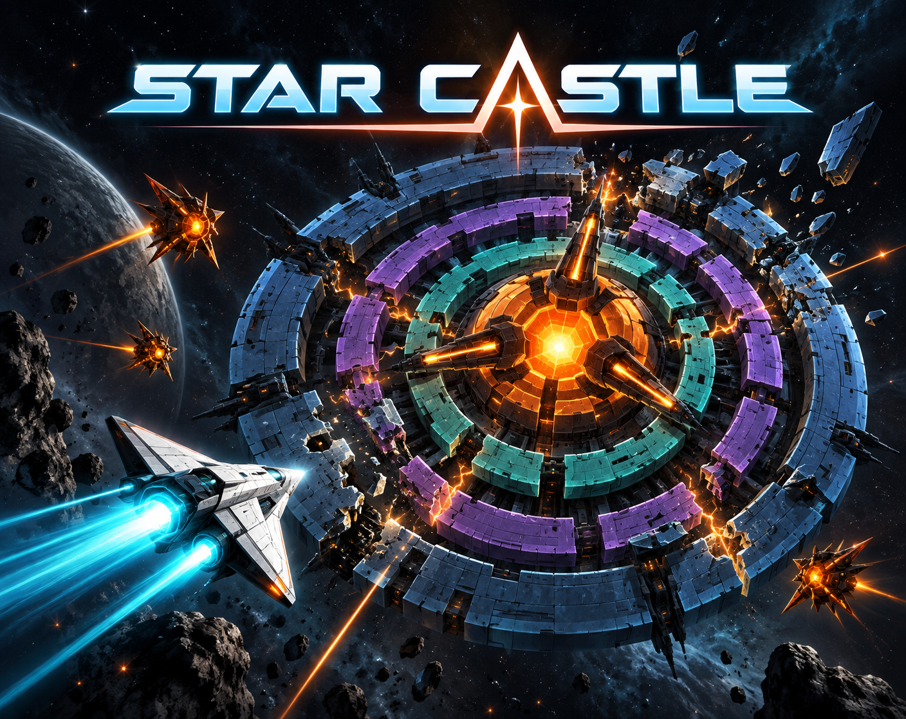
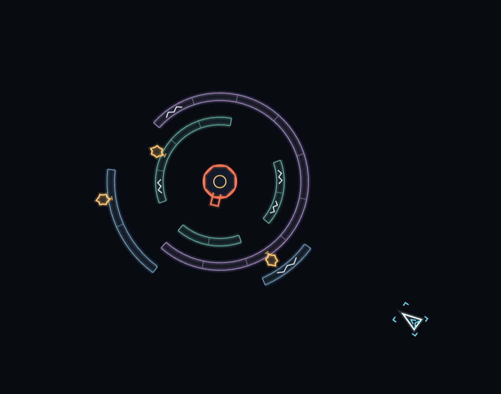

# Star Castle



[Play in your browser](https://stevencasteel.github.io/star-castle/) · [Play on itch.io](https://stevencasteel.itch.io/star-castle)



A compact procedural browser game: breach rotating shields, wear down the central boss, and evade sparks and cannon fire. Canvas 2D, TypeScript, Vite, native Web Audio, zero runtime dependencies, no menus or imported gameplay assets.

The cover is promotional artwork generated with AI; the gameplay screenshot above shows the procedural game. Artwork prompt and provenance: [`docs/COVER.md`](docs/COVER.md).

## Delivery: Phase 6 of 6

Build **0.6.0**, tuning version **2**, gameplay seed **1980**. All six implementation phases are complete, including the final source audit and the user's September 10 combat revision. Compilation results are recorded in `AUDIT.md`. The revised mechanics and experiential calibration are **awaiting human playtest**.

The user's latest direction supersedes the original `HANDOFF.md` in three places:

- The boss has **8 health**, losing one per player bullet that reaches the core. Remaining health survives player deaths and shield rebuilds; only the next castle or a new run refills it. The HUD and the core's interior cells show remaining health.
- Live rings **zap and rebound** the ship instead of killing it. The stun lasts **2 seconds**, disables thrust, and makes newly fired bullets travel at **half speed (310 units/s)**. Turning and firing cadence remain available. Amber electrical brackets, a countdown arc, a short buzz, and a `ZAPPED` timer make the state visible.
- **Scoring is removed completely**: no points, final-score display, segment reward flags, or spark point budget. The run still tracks rounds, lives, and completed castles for the survival-life bonus.

`HANDOFF.md` remains the original reference; this README and `AUDIT.md` describe the delivered revision. The prior screenshot was accepted by the user as looking good, but supplies no evidence for the new boss health or zap behavior.

## Launch

The locked development tools were used with Node 24.4.1 / npm 11.16.0.

```sh
npm ci
npm run dev
```

Open http://127.0.0.1:5173/ (or the URL Vite prints). Play starts immediately. Available verification/build commands:

```sh
npm run typecheck
npm run build
npm run preview
```

`dist/` contains the production build for static hosting. GitHub Pages deploys automatically from `main` through `.github/workflows/pages.yml`. The same relative-path build can be zipped with `index.html` at the archive root for itch.io. The development preview remains local to this machine.

## Controls

| Key | Action |
| --- | --- |
| Left / Right | Rotate; simultaneous inputs cancel |
| Up | Thrust; unavailable while zapped |
| X | Fire; hold to repeat, or tap |
| R | Restart the run immediately |
| M | Toggle sound |
| H | Replay controls without pausing |

Down, C, V, and Space are unassigned. Audio unlocks on a gameplay key or pointer gesture. Leaving the page or changing focus suspends simulation, clears input, and silences audio; returning discards elapsed time.

## Combat and continuity

Eight core hits are an initial choice for the requested health system, replacing the one-hit kill with sustained breach opportunities. No health scaling, healing, damage invulnerability, or additional boss phases were added. The last hit triggers one clear, even when several bullets arrive together. A nonfatal core hit produces a compact flash and low impact tone without interrupting the cannon's current commitment.

Ring rebound follows the resolved surface normal, away from the contacted material; hitting the inner face pushes toward the open space inside that ring. It preserves tangential motion before enforcing the ship's speed cap. The target normal rebound is the larger of 180 units/s and 75% of incoming normal speed. These conservative initial values fill the unspecified bounce strength. Rings remain solid, including during protection or stun; the ship cannot phase through them.

Fresh ring contacts can renew the two-second stun. A 0.20-second retrigger delay prevents adjacent-sector contacts from producing a rapid burst of stun events and sounds; it never disables the physical bounce. Stun duration is measured from contact on the simulation clock and pauses on focus loss or hit stop. Shots keep the speed assigned when fired: pre-zap shots remain fast, and shots fired while zapped remain slow after recovery. Firing cadence stays 0.14 s. These interpretation choices are recorded so later feedback can target them directly.

Spawn protection prevents lethal damage but does not prevent ring zaps. **The core body, sparks, and enemy orbs still cost a life on unprotected contact.** Zapping itself grants no extra invulnerability and causes no boss or shield damage. A rebound can therefore carry the ship into another hazard. Death, castle clear, and full restart clear stun and its penalties.

Start with three lives. Death clears orbs and cannon charge, reattaches sparks, preserves boss/shield damage, and respawns after 0.8 s. Surviving clears 3, 6, 9… award one life up to five. A death earlier in a castle does not disqualify a later living clear; a death in the finishing-hit tick or a finishing bullet during the death beat earns no bonus. Bonuses at five lives are discarded. Final death automatically restarts after its existing beat; a later finishing bullet cannot extend that deadline. Normal castle transitions last 1 s, preserve lives, and create a full-health boss and shields.

## Authoritative configuration

Gameplay values live in `src/config.ts`. Distances are logical units; rates use seconds and radians internally.

| System | Delivered configuration |
| --- | --- |
| Composition | 960×816; fixed 48-unit HUD, 960×720 arena, 48-unit footer. Uniform letterboxing; DPR capped at 2. Intended minimum viewport 800×680 CSS pixels. |
| Simulation | 60 Hz; at most five catch-up ticks. Cosmetic delta capped at 0.05 s. Time tolerance 1e-9 s. |
| Ship | Visible 24×16 triangle, 85% inset collision hull. Fresh-run position (480,620), heading up. Turn 270°/s, thrust 220 units/s², speed cap 260 units/s, zero drag. |
| Derived motion | 180° turn: 0.667 s. Rest to cap: 1.182 s. Counter-thrust stop at cap: 1.182 s / 153.6 units, excluding turn time. Analytical values, not measurements. |
| Player fire | Normal 620 units/s; zapped 310. Radius 2, trail 8, no ship-velocity inheritance. Interval 0.14 s, press buffer 0.08 s, maximum 64 shots. |
| Castle | Center (480,360), core radius 22, decorative barrel length 32, core health 8. Ring radii 144/112/80, thickness 10, twelve sectors each, offsets 0°/10°/20°, two health per segment. |
| Ring rebuild | Entirely destroyed ring waits 0.65 s before rebuilding. Occupied annulus stays dashed/pending and non-solid; leaving starts the full warning again. Boss health is unaffected. |
| Ring zap | Duration 2 s; no thrust; 0.5× bullet travel speed. Rebound target 180 units/s minimum, restitution 0.75, overall ship cap 260. Retrigger debounce 0.20 s. |
| Cannon | Turn 100°/s; charge eligibility within 6° and a clear radius-aware ray. Charge 0.45 s, last 0.20 s locked; recovery 0.65 s. Blocked release visibly discharges and takes full recovery. |
| Enemy orbs | Speed 240 units/s, radius 7, maximum 16. Straight, no wrapping; shields absorb without damage. |
| Sparks | Maximum three; 18×14 jagged outline, radius 6, one hit to destroy. Acceleration 150 units/s², turn cap 110°/s, angular acceleration 300°/s². Speed cap follows progression below. |
| Spark scheduling | First castle 6/9/12 s; later castles and death reattachment 2/4/6 s. Replacements wait at least 3.5 s. Recent replacement minimum waits survive another death. |
| Detachment safety | Warning at least 0.45 s; defer by 0.5 s if wrapped separation is under 96 units or projected closest approach within 0.75 s is under 48 units. |
| Respawn | Eight candidates on a 360×260 ellipse. Zero momentum, face the core, 1.2 s protection. Cannon charge inhibited for 1.4 s; spark countdowns pause during the death beat. |
| Numerical bounds | Sweeps use 0.001-unit distance and 0.000001 tick-fraction tolerances, 0.025-unit separation, up to twelve slide/projection contacts. |
| Resource limits | 400 particles, 128 transient visual pulses, 16 shake impulses, 16 sounding audio voices including three sustained oscillators. |

| Round | Outer / middle / inner ring speed | Spark speed cap |
| --- | --- | --- |
| 1 | +12 / −16 / +20°/s | 110 units/s |
| 2 | +12 / −16 / +20°/s | 130 units/s |
| 3 | +15 / −20 / +25°/s | 130 units/s |
| 4 | +15 / −20 / +25°/s | 145 units/s |
| 5 onward | +18 / −24 / +30°/s | 145 units/s |

Progression never shortens warnings, commitments, recovery, replacement delays, or protection. Ship flight and the eight-health boss remain fixed across rounds.

## Collision and spawn decisions

`src/geometry.ts` shares exact curved-sector queries across bullets, the inset triangular hull, and cannon clearance. Sweeps include rotating boundaries and hull rotation; wrapped movement splits at arena edges. Bullets resolve first contact by time and stable ID; equal-time geometry contacts prefer outer ring then lower sector. Destruction timestamps let later bullets use newly opened gaps while preserving earlier ship contacts. Every accepted shot also sweeps the center-to-muzzle path, preventing a near-wall shot from spawning beyond a shield.

Protected core contact separates and removes inward velocity. Ring contact uses the new rebound response. End-of-tick projection resolves remaining edge overlaps without granting penetration. Rebuilds check the full annulus against the active hull, including while zapped. Sparks/orbs retain their within-tick death/absorption times for chronological contacts. Core destruction and ship death are collected before cleanup, so a final-hit trade counts both once.

`src/spawn.ts` projects attached sparks to their future release positions, then estimates arrival using wrapped distance, inherited tangential speed, acceleration, and the round speed cap. It also estimates cannon aim/inhibit/charge/flight time through shields projected to release. Latest earliest arrival wins; current wrapped separation breaks ties. It consumes no randomness. The prediction assumes a stationary spawn candidate and does not forecast player controls, future bullets, later cannon openings, or delayed rebuilds. Protection and attack scheduling supply the fixed grace periods.

Spark mounts prefer surviving sectors. Replacements reject close or predicted-dangerous mounts, then consider empty bearings; if all fail, they use the farthest bearing. Mount centers sit 12 units outside each ring centerline. These details and the spawn ranking were unspecified in the original handoff. A xorshift32 generator chooses mounts with seed 1980, reset on a fresh run; cosmetic randomness is independent.

## Presentation and audio

| Feedback | Configuration |
| --- | --- |
| Drawing | Exact original palette; 1.5/2/3 line widths, glow width 6 at opacity 0.16. No text glow, imported assets, backgrounds, or extra panels. |
| Thrust/fire | Plume 18 in 0.04 s, settles to 14 over 0.08 s, releases within 0.10 s. Interior engine stretch at most 3%; weapon recovery 0.08 s. Muzzle radius 6→9 over 0.08 s. No routine-fire shake. |
| Damage/debris | Shield hit 0.09 s, four flecks 0.16 s; break eight fragments 0.28 s at 50–110 units/s plus ring velocity. Core hit 0.16 s. Zap contact accent 0.18 s; electrical frame and countdown follow stun. |
| Endings | Death fourteen hull-edge pieces within 0.55 s. Castle curved arcs/core facets stagger 0.12 s and clear by 0.65 s; wave radius 180 over 0.45 s. Reconstruction occupies the final 0.20 s of transition. |
| Shake/hit stop | Break 0.6 units / 0.08 s; death 3 / 0.25 s; castle 5 / 0.35 s. Hard combined cap 5; HUD stays stationary. Death stop 0.05 s; castle 0.07 s; simultaneous trade takes the longer stop. |
| Clocks | Stun, protection and warnings use simulation time. Cosmetic recovery and hit-stop release use bounded presentation time. Stopped frames discard gameplay backlog and hold current transforms until simulation resumes. |
| HUD/hints | Core health, round, lives. Hint 4–10 s then 0.25 s fade; H reveal 0.15 s. Three 0.8 s demos. Key travel 2, release 0.10 s. Life gain 1→1.15→1 in 0.25 s; round accent 0.25 s; mute accent 0.15 s. |
| Audio | Master gain 0.22 into compression; three reused oscillators plus at most thirteen sounding transients. One reusable 1-second generated noise buffer; ±2% cosmetic variation. Ordinary cues reserve four slots. Higher priorities fade lower cues for 8 ms before taking their slots. |
| Mix | Routine bus ducks to 0.30 over 0.012 s, holds 0.12 s, recovers 0.28 s. Warnings/rewards/blasts bypass ducking. No music or recordings. |
| Cue durations | Shot 0.045 s; shield hit 0.06; break 0.10; core hit 0.12; zap 0.18; cannon 0.12; blocked fizz 0.08; absorption 0.06; spark pop 0.08; spawn 0.10; life 0.18; death 0.25; castle 0.40. Exact gains/envelopes are in `CONFIG.audio` and `CONFIG.feedback`. |
| Reduced motion | Disables hit stop, camera shake, key travel, engine/weapon deformation, life scaling, moving demos and victory wave. Electrical brackets hold steady; countdown remains truthful. Particle travel 35%, opacity 0.30 versus normal 0.60. |

The original concave rear notch crossed the specified triangular collision hull. The visible outer triangle is closed, with the notch drawn inside it, preserving honest collision bounds. The core's radius-22 circle likewise exposes its collision extent. These documented visual corrections retain the configured sizes.

## Verification and human review

See `AUDIT.md` for the source audit and actual compilation results, and `PLAYTEST.md` for the complete ten-part checklist adapted to the requested mechanics. No browser driving, gameplay simulations, automated test suites, profiling, tuning sweeps, or test harnesses were used, following the adopted handoff workflow.

The user accepted the Phase 5 visuals. Boss health, zap duration/strength, half-speed shooting, collision edge cases, audio balance, and sustained runtime performance remain **awaiting human playtest**. Desktop keyboard is the target; small windows can reduce legibility. No mobile/gamepad controls, persistence, networking, or additional enemy types are included.
